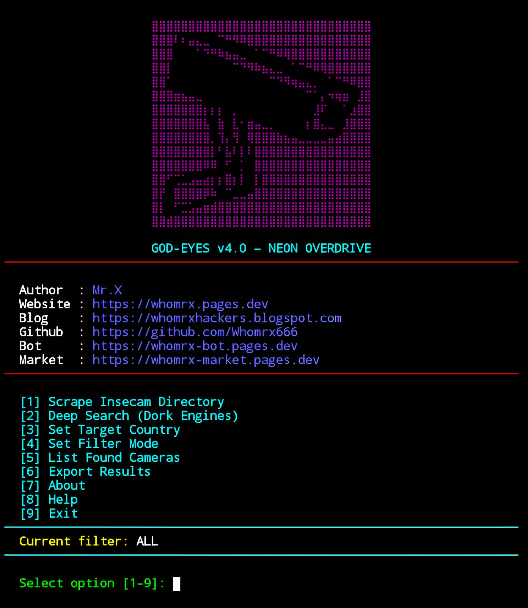

# GOD-EYES v4.0


<p align="center">
  <strong>Public IP Camera Reconnaissance Tool – Multi-Engine Dorking & Insecam Scraper</strong><br>
  <em>"Vigilance in the neon-lit shadows of cyberspace." – Mr.X</em>
</p>

## Introduction
GOD-EYES v4.0 – NEON OVERDRIVE is a cutting-edge surveillance and reconnaissance tool designed to discover publicly accessible IP cameras worldwide. Integrating **multi-source scraping** (including the Insecam directory) and **multi-engine dorking** across Yahoo, Startpage, Bing, DuckDuckGo, Mojeek, and Searx, it locates live camera feeds efficiently. The tool verifies streams (MJPEG, JPEG snapshots, video feeds), enriches camera data with GeoIP location, and exports results in JSON, CSV, or HTML formats. All wrapped in a sleek neon cyberpunk terminal interface optimized for responsive terminal widths.

**Important:** This tool is strictly intended for educational and authorized security research use only.

## Features
- **Insecam Directory Scraper**: Extract public IP cameras by country or globally.
- **Multi-Engine Dorking**: Utilizes over 100 specialized camera dorks across 6 search engines for deep reconnaissance.
- **Live Camera Verification**: Confirms liveliness and media type (stream/snapshot/video).
- **GeoIP Enrichment**: Adds city and country location info to discovered cameras.
- **Export Capabilities**: Save scan results in JSON, CSV, or stylish HTML report.
- **Flexible Filter Modes**: Show all cameras, streams only, or snapshots only.
- **Responsive Neon Cyberpunk UI**: Dynamic terminal width support, colorful LED-like styling.
- **Proxy Support**: Anonymize scans (proxy integration included).
- **Concurrency**: Multi-threaded for efficient scanning.
- **Cross-platform**: Runs on Linux, Windows, Termux (Android), no root required.

## Installation
```bash
$ pkg update -y && pkg upgrade -y
$ pkg install git python -y
$ git clone https://github.com/Whomrx666/God-eyes.git
$ cd God-eyes
$ python3 install.py
```
## Run manually
```
$ python3 god-eyes.py
```

## Modules Overview
| Option | Description |
|--------|-------------|
| 1      | Scrape Insecam Directory (choose country and pages) |
| 2      | Deep Search using multi-engine dorking |
| 3      | Set Target Country (for Insecam scraper) |
| 4      | Set Filter Mode (ALL, STREAM, SNAPSHOT) |
| 5      | List Found Cameras from current session |
| 6      | Export current session results (JSON, CSV, HTML) |
| 7      | About GOD-EYES and author info |
| 8      | Help and Usage Instructions |
| 9      | Exit the program |

## How It Works
- **Insecam Scraper**: Collects camera URLs from the public Insecam directory, filtering out ads and irrelevant images.
- **Dork Engines**: Runs hundreds of camera-specific queries ("dorks") across multiple search engines concurrently to gather potential camera URLs.
- **Verification**: Each candidate URL is tested for liveliness and content type to classify as live stream, snapshot, or video feed.
- **GeoIP**: Uses `ip-api.com` to locate the camera host's city and country.
- **Export**: Saves scan results with full metadata for offline analysis or reporting.

## Disclaimer
This tool is made for **educational and authorized security research purposes only**. Unauthorized scanning, accessing, or exploiting devices you do not own or have explicit consent for is illegal and unethical. The author is **not responsible** for any misuse or damages resulting from this tool.

### Original Author
<a href="https://github.com/Whomrx666"></a>

### <<< If you copy, then give me the credits >>>

## CONNECT WITH ME :

[](https://whomrx.pages.dev) <br>
[](https://whomrxhackers.blogspot.com) <br>
[](https://twitter.com/whomrx666) <br>
[](https://wa.me/6285926601133?text=Halo%2C%20Mr.X) <br>
[](https://www.facebook.com/whomrx.666) <br>
[](https://t.me/Whomr_X) <br>
[](mailto:whomrx666@gmail.com) <br>
[](https://www.tiktok.com/@whomr.x)

**If you want to donate, click on the button**
<a href="https://saweria.co/whomrx"></a>

---

<p align="left">
  
</p>